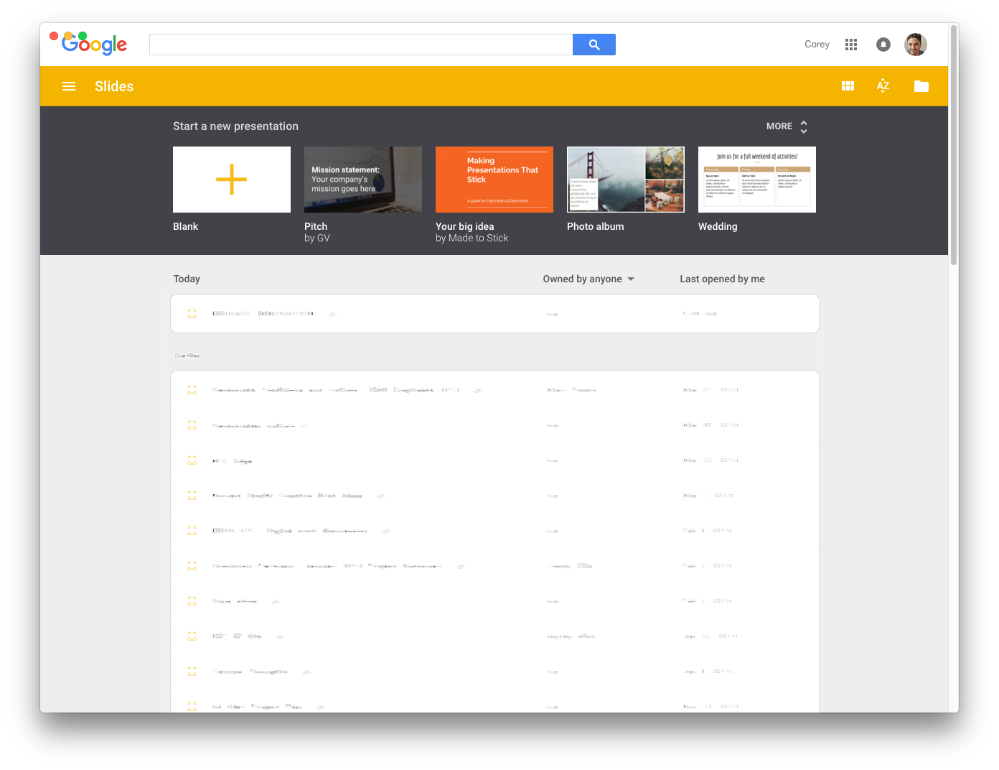

#  Google Slides Desktop

> An unofficial Google Slides App built with [Electron](https://github.com/electron/electron)



## Why?
Ever need want to close Chrome but still work on a presentation?  That's why

## Development
Google Slides is built with [Electron](https://github.com/electron/electron).

#### Commands
- **Install npm dependencies:**

  ```bash
  $ npm install
  ```

- **Run the app:**

  ```bash
  $ npm start
  ```

- **Lint:**

  ```bash
  $ npm run lint
  ```

- **Build OS X:**

  ```bash
  $ npm run build:osx
  ```

  or

  ```
  $ electron-packager ./ --out=build --overwrite --platform=darwin --arch=x64 --icon=./assets/icons/icon.icns
  ```
